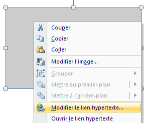
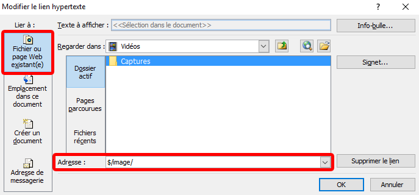

PPT Templates
=============

[](https://travis-ci.org/Coreoz/PPT-Templates)

PPT Template is a small templating library to generate PowerPoint presentations.
This project is mainly based on [POI XSLF](https://poi.apache.org/slideshow/xslf-cookbook.html).

Templates are directly created in PowerPoint using a variable system.

Getting started
---------------
Include PPT Templates in your project:
```xml
<dependency>
    <groupId>com.coreoz</groupId>
    <artifactId>ppt-templates</artifactId>
    <version>1.0.0-beta1</version>
</dependency>
```

Create a template and fill it with your data:
```java
try(FileOutputStream out = new FileOutputStream("generated.pptx")) {
  new PptMapper()
    .text("title", "Hello")
    .text("subtitle", "World!")
    .processTemplate(PptTemplateDemo.class.getResourceAsStream("/title.pptx"))
    .write(out);
}
```
Tadaaa:


Features
--------
- text replacement,
- image replacement,
- text and shape styling,
- text, shape and image hiding.

This features are directly configurable via the `com.coreoz.ppt.PptMapper` API.

For image replacement, styling or hiding elements, variables must be put on a link
on these elements.

Step 1:



Step 2:



Demo
----
See the [demonstration project](demo).
